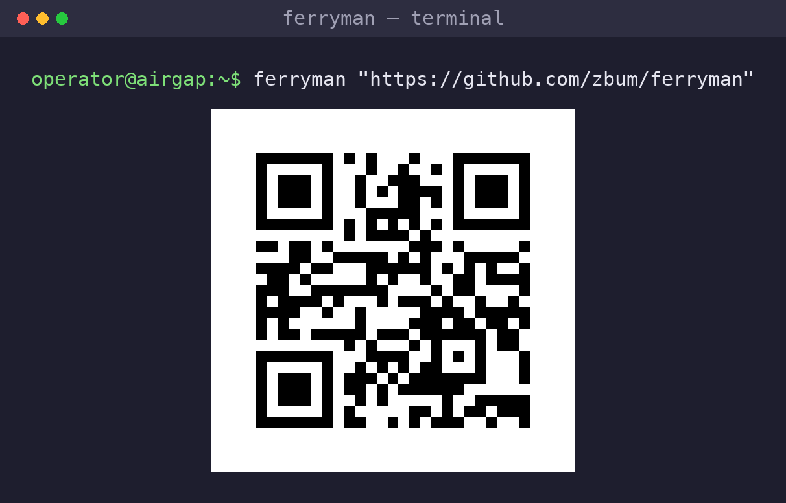
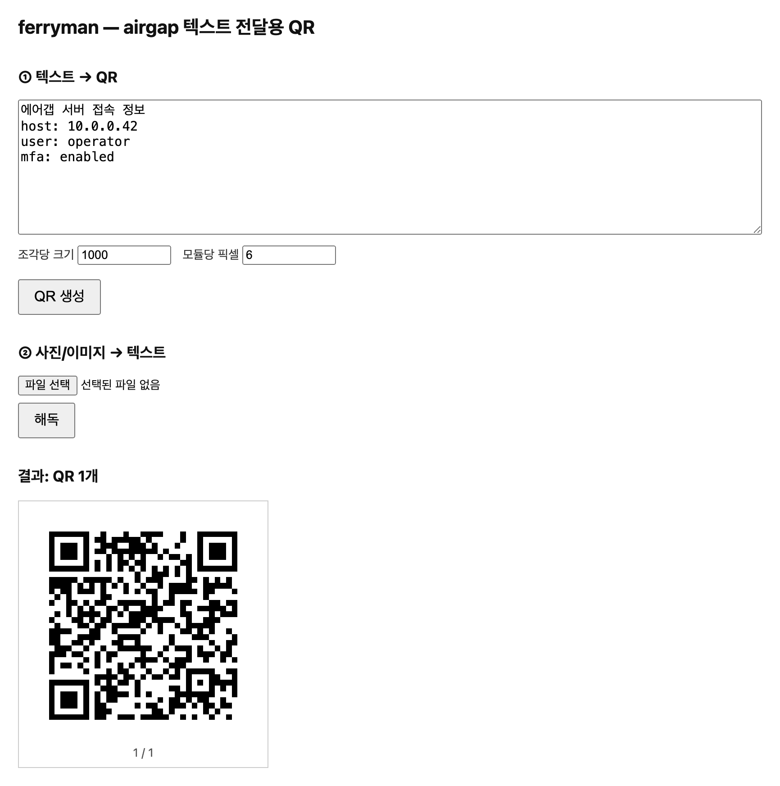

# ferryman

> 에어갭(망분리) 너머로 **텍스트를 QR 사진으로 실어나르는** 뱃사공.

GUI 없는 서버 콘솔에서는 터미널에 QR 을 그려 휴대폰으로 촬영하고, 받는 쪽에서는
사진을 다시 텍스트로 해독합니다. 긴 텍스트는 여러 개의 QR 로 자동 분할·재조립됩니다.
의존성 없는 **단일 정적 바이너리**라 인터넷이 없는 환경에 그대로 복사해 쓸 수 있습니다.

<p align="center">
  
</p>

## 왜 ferryman 인가

에어갭 환경에서 텍스트(접속 정보, 설정값, 로그 조각)를 밖으로 빼내는 가장 확실한
경로는 **화면을 휴대폰으로 찍는 것**입니다. ferryman 은 그 흐름을 양방향으로 자동화합니다.

- 🖥 **터미널 QR** — 유니코드 반칸(▀)으로 콘솔에 QR 출력. 화면을 그대로 촬영.
- 🌐 **웹 UI** — 브라우저에서 텍스트 입력 → QR, 사진 업로드 → 텍스트.
- 🖼 **PNG 파일** — QR 이미지를 문서/메신저로 전달.
- ✂️ **자동 분할** — 긴 텍스트를 여러 QR 로 나누고, 사진들에서 원문을 자동 재조립.
- 🔄 **양방향** — 인코딩(텍스트→QR)과 디코딩(사진→텍스트)을 한 바이너리에서.
- 📦 **의존성 0** — `CGO_ENABLED=0` 순수 Go 정적 바이너리. libc 의존 없음.

## 웹 UI

```sh
ferryman serve -addr :8080     # http://<host>:8080
```

<p align="center">
  
</p>

한 화면에서 ① 텍스트→QR 생성, ② 사진→텍스트 해독을 모두 할 수 있습니다. 외부
CSS/JS/CDN 의존이 전혀 없어 망분리 내부에서도 그대로 동작합니다.

## 설치 / 빌드

인터넷이 되는 개발 머신에서 빌드해 airgap 으로 **바이너리만 복사**합니다.

```sh
make build          # 현재 플랫폼
make build-all      # linux/windows/darwin (amd64/arm64) 전체 → dist/
make test           # 단위 테스트
make vendor         # 의존성을 vendor/ 로 고정 (airgap 재빌드 대비)
```

`vendor/` 를 커밋해 두면 airgap 내부에서도 인터넷 없이 `make build` 가 됩니다.
릴리스 페이지의 사전 빌드 바이너리를 내려받아 바로 써도 됩니다.

## 사용법

### 1) 터미널에 QR 출력 (보내는 쪽, 콘솔 환경)

```sh
ferryman "전달할 텍스트"
cat config.yaml | ferryman         # stdin 도 지원
```

콘솔에 뜬 QR 을 휴대폰 카메라로 촬영합니다. 텍스트가 길면 `── QR 1 / N ──`
라벨과 함께 여러 개가 순서대로 출력됩니다.

### 2) 파일(txt/md 등)을 QR 로

```sh
ferryman -i notes.md               # 파일 내용을 터미널 QR 로
ferryman -i notes.md -o notes.png  # PNG 로 저장 (분할 시 notes-1.png ...)
```

### 3) PNG 파일로 저장

```sh
ferryman -o out.png "텍스트"        # 분할되면 out-1.png, out-2.png ...
```

### 4) 사진 → 텍스트 해독 (받는 쪽)

```sh
ferryman decode photo1.jpg photo2.jpg ...    # stdout 으로 원문 출력
ferryman decode -o result.txt photo*.png     # 파일로 저장 (-o 는 파일 인자 앞에)
```

여러 장을 한 번에 넘기면 순서가 뒤섞여 있어도 헤더로 자동 정렬·재조립합니다.

## 옵션

| 옵션      | 대상          | 설명                                              |
|-----------|---------------|---------------------------------------------------|
| `-i`      | encode        | 입력 파일 경로 (txt/md 등). 지정 시 파일 내용을 인코딩 |
| `-o`      | encode/decode | 출력 파일명 (encode: PNG, decode: 텍스트)          |
| `-bytes`  | encode        | **QR 1개당 원문 바이트 수** (기본 500, 최대 700). 줄이면 QR 이 작고 장수↑ |
| `-level`  | encode        | 오류정정 `l\|m\|h\|x` (기본 `l`, 용량 우선)         |
| `-scale`  | encode        | PNG 모듈당 픽셀 (기본 8)                            |
| `-addr`   | serve         | 수신 주소 (기본 `:8080`)                            |

입력 우선순위(encode): **`-i` 파일 > 위치 인자 텍스트 > stdin**.

## 동작 원리 (다중 분할)

- 한 QR 에 들어가는 짧은 텍스트는 **원문 그대로** 인코딩되어 일반 QR 앱으로도 읽힙니다.
- 길어서 분할이 필요하면 원문을 `-bytes` 크기로 잘라 **각 조각을 base64 로 감싸고**
  `QRG1|<id>|<seq>/<total>|<data>` 헤더를 붙입니다. `<id>` 는 원문 해시라
  서로 다른 전송이 섞이지 않습니다. 임의 바이트·한글·이모지 모두 안전하게 왕복합니다.
- 받는 쪽은 사진들에서 각 조각을 읽어 `<seq>` 순으로 정렬·복호해 원문을 복원합니다.

## 촬영 팁 (열악한 환경)

- 터미널 폰트를 키우거나 화면을 확대해 QR 이 또렷하게 나오도록 합니다.
- 초점을 맞추고 정면에서, 화면 반사가 없도록 촬영합니다.
- 인식이 잘 안 되면 `-bytes` 를 줄여(예: 300) QR 을 더 작고 성기게 만듭니다(장수는 늘어남).
- 오류정정을 높이려면 `-level h` — 단, 조각 수가 늘 수 있습니다.

> QR 1개당 데이터가 너무 많으면(≈700바이트 초과) QR 버전이 높아져 카메라가 검출에
> 실패할 수 있어, `-bytes` 는 700 을 넘지 않도록 자동으로 잘립니다. 확실한 스캔이
> 필요하면 기본값(500)이나 그 이하를 쓰세요.

## 라이선스

MIT
